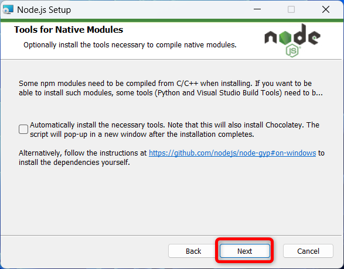

# Node.js

## インスールの手順

### ダウンロード

下記サイトからNode.jsをダウンロードする  
https://nodejs.jp/


`ダウンロード`フォルダに保存する  


### インスール

ダウンロードしたファイルを実行  


`Next`をクリック  


`I accept～`にチェックを入れて`Next`をクリック  


`Next`をクリック  


`Next`をクリック  


`Next`をクリック  


`Install`をクリック  


インスールが始まるので待つ  


`Finish`をクリック  


## インストールの確認

コマンドプロンプトを起動して、下記コマンドを実行して  
バージョンが表示されたらインストール成功

### Node.jsのインストール確認

```bash
node --version
```


### npmコマンドの確認

```bash
npm --version
```


### npxコマンドの確認

```bash
npx --version
```


